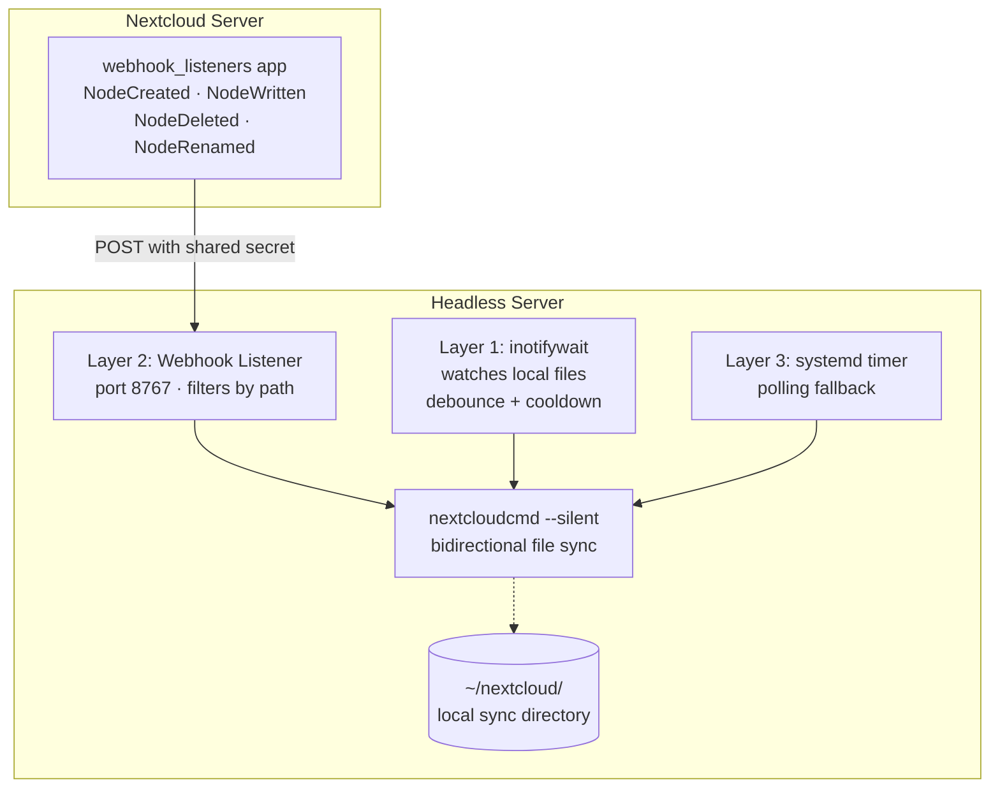

# nextcloud-sync-daemon

Event-driven sync daemon for headless Nextcloud servers. Wraps `nextcloudcmd` with filesystem watching, webhook push notifications, and configurable polling fallback — in a single binary.

## Features

- **Filesystem watcher** — detects local file changes via inotify and triggers immediate sync
- **Webhook listener** — receives push notifications from Nextcloud when server-side files change
- **Polling fallback** — periodic sync as a safety net when events are missed
- **Unified event loop** — all triggers feed a single queue with deduplication and cooldown, preventing sync storms
- **Health endpoint** — JSON status with uptime, sync counts, and source state
- **Systemd-native** — `Type=notify` readiness, watchdog heartbeat, structured logging to journal

## Requirements

- `nextcloudcmd` (from the `nextcloud-desktop-cmd` package on Debian/Ubuntu)
- Linux (filesystem watcher uses inotify)
- That's it.

## Installation

### Download

Pre-built binaries for `linux/amd64` and `linux/arm64` are available from [GitHub Releases](https://github.com/graemejross/nextcloud-sync-daemon/releases).

Download the appropriate `.tar.gz` for your architecture, then extract:

```bash
tar xzf nextcloud-sync-daemon_*.tar.gz
```

### Build from source

```bash
git clone https://github.com/graemejross/nextcloud-sync-daemon.git
cd nextcloud-sync-daemon
make build
```

Requires Go 1.23+.

### Install the binary

```bash
sudo cp nextcloud-sync-daemon /usr/local/bin/
```

## Configuration

Create a config file. The daemon searches these locations in order:

1. `--config` flag
2. `$NEXTCLOUD_SYNC_CONFIG` environment variable
3. `/etc/nextcloud-sync-daemon/config.yaml`
4. `~/.config/nextcloud-sync-daemon/config.yaml`

### Minimal config

```yaml
server:
  url: https://cloud.example.com
  username: sync-user
  password_file: /etc/nextcloud-sync-daemon/password

sync:
  local_dir: /home/user/nextcloud

watch:
  enabled: true

poll:
  enabled: true
  interval: 60s
```

### Create the password file

Use a [Nextcloud app password](https://docs.nextcloud.com/server/latest/user_manual/en/session_management.html#manage-connected-browsers-and-devices) rather than the main account password.

```bash
sudo mkdir -p /etc/nextcloud-sync-daemon
echo "your-app-password" | sudo tee /etc/nextcloud-sync-daemon/password > /dev/null
sudo chmod 600 /etc/nextcloud-sync-daemon/password
```

### Validate and test

```bash
# Validate config
nextcloud-sync-daemon --validate --config /etc/nextcloud-sync-daemon/config.yaml

# Run a single sync and exit
nextcloud-sync-daemon --once --config /etc/nextcloud-sync-daemon/config.yaml
```

### Full configuration reference

See [`examples/config.yaml`](examples/config.yaml) for all options with documentation. All durations accept Go duration strings (`"5m"`, `"30s"`, `"1h30m"`) or integer seconds.

## Usage

```
nextcloud-sync-daemon [flags]
```

| Flag | Description |
|------|-------------|
| `--config PATH` | Path to config file |
| `--once` | Run a single sync and exit |
| `--validate` | Validate config and exit |
| `--version` | Print version and exit |

Without `--once`, the daemon runs continuously, syncing on events from enabled sources (watcher, webhook, poller).

## Running as a systemd service

An example unit file is provided at [`examples/nextcloud-sync-daemon.service`](examples/nextcloud-sync-daemon.service).

### System-wide service

```bash
sudo cp nextcloud-sync-daemon.service /etc/systemd/system/
sudo systemctl daemon-reload
sudo systemctl enable --now nextcloud-sync-daemon
```

### User service (no root required)

```bash
mkdir -p ~/.config/systemd/user
cp nextcloud-sync-daemon.service ~/.config/systemd/user/
systemctl --user daemon-reload
systemctl --user enable --now nextcloud-sync-daemon
loginctl enable-linger $USER   # start at boot without login
```

### Monitoring

The daemon logs to stderr (no log files). When running under systemd, logs go to the journal:

```bash
# Check status
systemctl --user status nextcloud-sync-daemon

# Follow logs
journalctl --user -u nextcloud-sync-daemon -f

# Health endpoint (if enabled)
curl http://127.0.0.1:8768/
```

## Webhook setup (Nextcloud server)

Webhooks enable near-instant sync when files change on the server (uploads via web, mobile, or other clients). This requires the `webhook_listeners` app on your Nextcloud server.

### 1. Enable the app

```bash
# On the Nextcloud server
sudo -u www-data php /var/www/nextcloud/occ app:enable webhook_listeners
```

### 2. Register webhook listeners

Register four event types via the Nextcloud OCS API. Replace `NEXTCLOUD_URL`, `ADMIN_USER`, `ADMIN_PASS`, `DAEMON_URL`, `NC_USERNAME`, and `WEBHOOK_SECRET` with your values:

```bash
for event in NodeCreatedEvent NodeWrittenEvent NodeDeletedEvent NodeRenamedEvent; do
  curl -s -u "ADMIN_USER:ADMIN_PASS" \
    -H "OCS-APIREQUEST: true" \
    -H "Content-Type: application/json" \
    -X POST "NEXTCLOUD_URL/ocs/v2.php/apps/webhook_listeners/api/v1/webhooks?format=json" \
    -d "{\"httpMethod\":\"POST\",\"uri\":\"DAEMON_URL\",\"event\":\"OCP\\\\Files\\\\Events\\\\Node\\\\${event}\",\"userIdFilter\":\"NC_USERNAME\",\"headers\":{\"X-Webhook-Secret\":\"WEBHOOK_SECRET\"}}"
done
```

- `DAEMON_URL` is `http://YOUR_SERVER_IP:8767/` (the daemon's webhook listen address)
- `NC_USERNAME` filters events to only the sync user's files
- `WEBHOOK_SECRET` must match `webhook.secret` in the daemon config

### 3. Enable webhook in daemon config

```yaml
webhook:
  enabled: true
  listen: 0.0.0.0:8767
  secret: your-webhook-secret
  path_filter: /          # or /username/ to filter by path prefix
```

### 4. Verify

```bash
# Test the webhook endpoint
curl -X POST http://localhost:8767/ \
  -H "X-Webhook-Secret: your-webhook-secret" \
  -H "Content-Type: application/json" \
  -d '{"event":{"class":"NodeCreatedEvent","node":{"path":"/test.txt"}}}'
```

## Security Considerations

**Password exposure via process list.** The daemon passes the Nextcloud password as a command-line argument to `nextcloudcmd` (`-p PASSWORD`), which is visible via `ps` to other users on the same system. This is a limitation of `nextcloudcmd` — it does not support reading passwords from stdin or environment variables. Mitigations:

- Use a **Nextcloud app password** (limited scope) rather than the main account password
- Run the daemon as a **dedicated user** with restricted access
- Use `ProtectProc=invisible` in the systemd unit (included in the example service file) to hide `/proc` entries from other users (requires systemd 247+)
- Set password file permissions to `0600` — the daemon warns at startup if the file is world-readable

**Webhook endpoint.** Authenticated with a shared secret using timing-safe comparison (`crypto/subtle`). Per-IP rate limiting (1 request per 5 seconds) protects against replay attacks. The endpoint accepts POST requests on a configurable port (default 8767).

**Health endpoint.** Disabled by default. When enabled, it binds to `127.0.0.1:8768` (localhost only). If bound to a public address, it exposes operational information (uptime, sync counts, failure rates). The daemon warns at startup if the health endpoint is bound to a non-localhost address.

## Non-Goals

- **Reimplementing the Nextcloud sync protocol.** The daemon wraps `nextcloudcmd`, not replaces it.
- **Replacing the desktop client.** This tool is for headless servers. If you have a display server, use the official Nextcloud desktop client.
- **Multi-account sync.** The daemon syncs one local directory with one remote path. Run multiple instances for multiple accounts.

---

## Development History

This project is built using [Claude Code](https://claude.ai/claude-code) as a practical test of AI-assisted development. The development process — including decisions, mistakes, and iterations — is documented transparently. See [`docs/JOURNAL.md`](docs/JOURNAL.md) for the full narrative.

### The Problem

Nextcloud provides excellent sync for desktop and mobile clients, but headless servers are underserved. The available options:

- **Desktop client** — GUI-based, polls every ~30 seconds. Requires a display server. Not suitable for headless servers.
- **`nextcloudcmd`** — CLI tool that performs a single sync and exits. No daemon mode, no file watching, no push notifications. To achieve continuous sync, you must call it repeatedly from cron or a loop.

For headless Linux servers (VMs, Raspberry Pis, NAS devices), this means sync latency is entirely determined by your cron interval. A 5-minute cron gives 5-minute latency. A 30-second cron gives 30-second latency but generates unnecessary load when nothing has changed.

### The Prototype

This project grew out of a production Nextcloud deployment syncing files across two headless Debian servers — a primary VM (Proxmox) and a contingency Raspberry Pi 5. The prototype was a three-layer architecture:



The prototype used bash + inotifywait for filesystem watching, a Python HTTP server for webhooks, and a systemd timer for polling — three separate scripts, four systemd units, plus logrotate. It worked but was fragile: sync storm loops, 3.5 GB/day log volume, PID lock file races, and credentials in shell environment variables.

### Prototype vs Go Daemon

| Aspect | Prototype | Go Daemon |
|--------|-----------|-----------|
| Language | Bash + Python | Go |
| Components | 3 scripts + 4 systemd units + logrotate | Single binary |
| Filesystem watching | `inotifywait` (external) | `fsnotify` (built-in) |
| Webhook listener | Python HTTP server (separate process) | Built-in HTTP server (same process) |
| Polling fallback | systemd timer (external) | Built-in ticker (same process) |
| Event deduplication | File-based cooldown timestamp | In-memory event queue with coalescing |
| Lock management | PID file with stale detection | Not needed (single process) |
| Credential storage | Sourced shell environment file | Config file with restricted permissions |
| Health check | HTTP GET on webhook port | Dedicated health endpoint with sync status |

### Lessons Learned from the Prototype

**Sync storm loop.** When a file updates frequently on the server, webhook triggers sync, sync writes locally, watcher triggers another sync, repeat. Produced ~20 syncs per minute with no useful work. Fixed in the Go daemon with a unified event queue — all triggers feed one channel with configurable cooldown.

**Log volume.** `nextcloudcmd` produces ~3.5 GB/day of debug output. The Go daemon uses structured logging with configurable verbosity (`debug`, `info`, `warn`, `error`), writing to stderr for journal integration.

**Lock file races.** The prototype's PID-based lock file had race conditions. The Go daemon uses a single process with an internal event queue — no inter-process coordination needed.

**Credential management.** The prototype sourced shell variables, exposing credentials in the process environment. The Go daemon reads credentials from a dedicated file with permission checking.

## Status

**v0.2.0.** Health endpoint enhancements (#19), peer-to-peer notification (#17), sync test command (#18). ~112 tests across 8 packages.

## License

MIT
